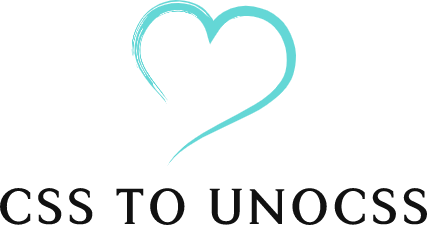

<p align="center">

</p>

This library is to convert css in vue to unocss. [unocss](https://github.com/unocss/unocss) can reuse styles better to reduce the packaging volume, which can be converted as a performance optimization method, and it can also make it easier for old projects to upgrade to unocss

# Install

```
  npm i -g transform-to-unocss
```

# cli

```
  转换：tounocss + 目录
  tounocss playground
  撤销： tounocss + 目录 + --revert
  tounocss payground --revert
```

# vite

```
  import { vitePluginTransformToUnocss } from 'transform-to-unocss'
  plugins: [ vitePluginTransformToUnocss() ]
```

# Feature

- transform class to unocss

## Before


## After


# todo

- [x] support xx + xx
- [x] support attribute selector .xx[]
- [x] support .a.b
- [x] support @media
- [x] support tail
- [x] support !important
- [ ] Working with style weights
- [ ] support react
- [x] 属性选择器支持[name="xxx"]
