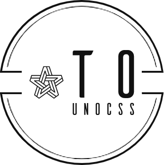

<p align="center">

</p>
<p align="center"> <a href="./README.md">English</a> | 简体中文</p>

这个库就是把 css 转成 unocss 的。 [unocss](https://github.com/unocss/unocss) 可以更好的复用样式减少打包体积，可以转化为一种性能优化的方式，也可以让老项目更容易升级到 unocss。

## 📦 Install

```
  npm i -g transform-to-unocss
```

## 🦄 cli

```
  ## command: tounocss + directory
  tounocss playground

  ## revoke: tounocss + directory + --revert
  tounocss payground --revert
```

## 🌈 Usage

<details>
<summary>Vite</summary>

```ts
// vite.config.ts
import { vitePluginTransformToUnocss } from 'transform-to-unocss'
export default defineConfig({
  plugins: [vitePluginTransformToUnocss(/* options */)],
})
```

</details>
<br>
<details>
<summary>Rollup</summary>

```ts
// rollup.config.js
import { resolve } from 'path'
import { rollupTransformToUnocss } from 'transform-to-unocss'
export default {
  plugins: [rollupTransformToUnocss(/* options */)],
}
```

</details>
<br>
<details>
<summary>Webpack</summary>

```ts
// webpack.config.js
module.exports = {
  /* ... */
  plugins: [
    require('transform-to-unocss').webpackTransformToUnocss({
      /* options */
    }),
  ],
}
```

</details>
<br>
<details>
<summary>Vue CLI</summary>

```ts
// vue.config.js
module.exports = {
  configureWebpack: {
    plugins: [
      require('transform-to-unocss').webpackTransformToUnocss({
        /* options */
      }),
    ],
  },
}
```

</details>
<br>
<details>
<summary>Esbuild</summary>

```ts
// esbuild.config.js
import { build } from 'esbuild'
import { esbuildTransformToUnocss } from 'transform-to-unocss'

build({
  plugins: [esbuildTransformToUnocss(/* options */)],
})
```

</details>

## ⭐ Feature

- 支持 css 在 '.html' | '.tsx' | '.vue' | '.astro' | '.svelte' 转换到 unocss
- 支持 sass less stylus 类型的转换
- 支持 vite | rollup | webpack | vue-cli | esbuild 作为插件使用
- vscode 扩展 [To Unocss](https://github.com/Simon-He95/tounocss)

## 🚁 More

- [transform-to-unocss-core](https://github.com/Simon-He95/transform-to-unocss-core) - 提供浏览器端转换 css 为 unocss 的能力

## 编译前


## 编译后


## :coffee:

[请我喝一杯咖啡](https://github.com/Simon-He95/sponsor)

## License

[MIT](./license)
